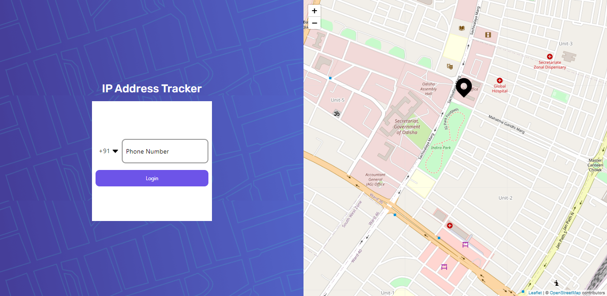
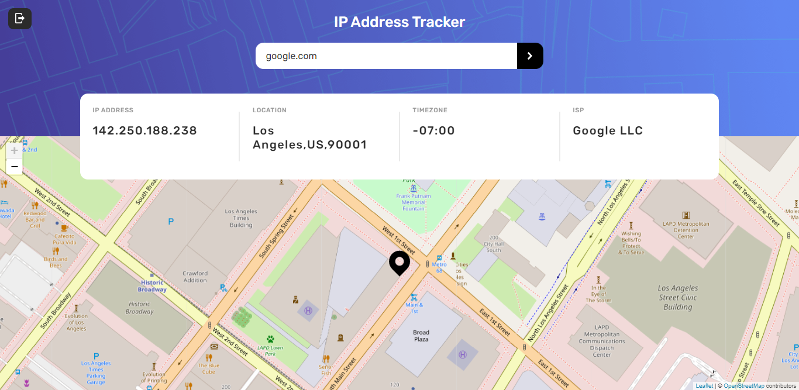
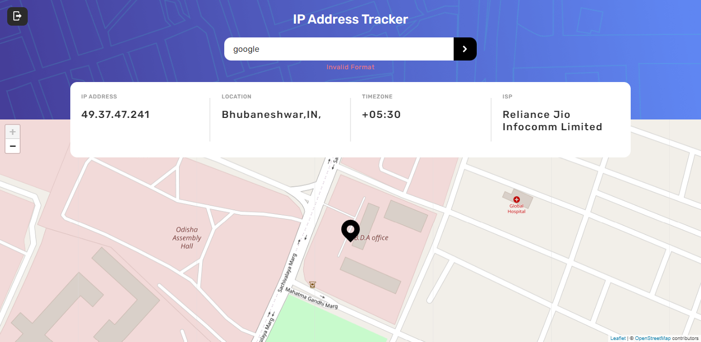
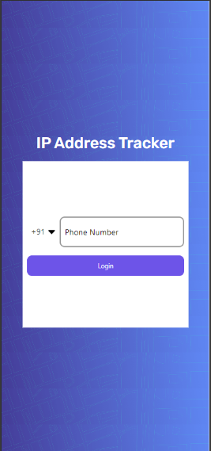
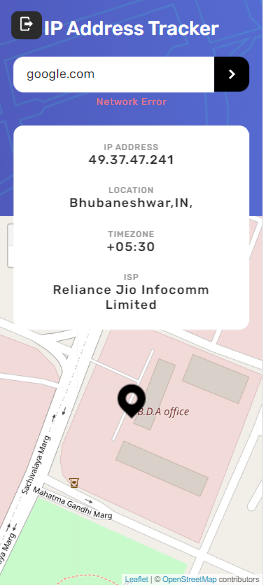

## Table of contents

- [Overview](#overview)
  - [The challenge](#the-challenge)
  - [Screenshot](#screenshot)
  - [Links](#links)
- [My process](#my-process)
  - [Built with](#built-with)
  - [Development Setup](#development-setup)
  - [Production Setup](#production-setup)

**Note: Delete this note and update the table of contents based on what sections you keep.**

## Overview

- The `IP Address Tracker` one user can log in using his/her mobile number and OTP(`Passwordless`, thanks to `SAWO` for such an amazing passwordless SDK).
- On successful login user can see his/her own IP address with timezone, and ISP details with live location on the map.
- User can also search for IP address and domain in the search box as well.

### The challenge

Users should be able to:

- Login using SAWO sdk (the passwordless way)
- View the optimal layout for each page depending on their device's screen size
- See hover states for all interactive elements on the page
- See their own IP address on the map on the initial page load
- Search for any IP addresses or domains and see the key information and location
- User can also redirect if he/she does not log out from the webapp.
- Route-specific login. (Non-authenticated users can not search for IP address or domain).

### Screenshot

- Home Screen
  
- Map Screen
  
- Map Screen Search
  
- Validate Search Empty
  
- Validate Search Invalid
  
- Validate Search Offline
  

- Mobile Screen
  
  

- Authenticated Route

  https://firebasestorage.googleapis.com/v0/b/blog-spot-e4923.appspot.com/o/videos%2Fsawo-demo-auth.mp4?alt=media&token=e0e0b7ec-b6fc-4fd1-b12d-e3fdfe3b1d77

### Links

- Solution URL: [Github](https://github.com/JeevantheDev/IP-Tracker)
- Live Site URL: [Netlify](https://ip-tracker-prod.netlify.app/)

## My process

### Built with

- Semantic HTML5 markup
- CSS custom properties
- Flexbox
- Mobile-first workflow
- [React](https://reactjs.org/) - JS library
- Design Pattern: [React Context API](https://reactjs.org/docs/context.html) Provider Pattern
- Authentication: [SAWO](https://sawolabs.com/)
- IP-Address Geo Api: [Ipify API](https://geo.ipify.org/)
- Map- [leaflet](https://leafletjs.com/)
- Editor Format: [VSCode](https://code.visualstudio.com/), [Prettier](https://prettier.io/), [eslint](https://eslint.org/)

### Development Setup

- Make sure you have [Prettier](https://marketplace.visualstudio.com/items?itemName=esbenp.prettier-vscode) and [Eslint](https://marketplace.visualstudio.com/items?itemName=dbaeumer.vscode-eslint) exntension installed on your `editor`.

- Install all the required `node_modules`

```
    npm i or yarn
```

- First go to [Ipify](https://geo.ipify.org/) create an account for `free` and `copy` the API key.
- Then go to [SAWO](https://sawolabs.com/) register for an account by creating a new project host named as `localhost` and `copy` the `SAWO API KEY`.

- Create a `.env.dev` file in the root of the project directory. Then add

```
REACT_APP_ENV = "dev"
REACT_APP_IP_GEO_API=***your geo api key***
REACT_APP_GEO_API_PATH=https://geo.ipify.org/api/v1
REACT_APP_SAWO_API_KEY=***your dev-project sawo api***

```

- Run the `development` server by

```
npm run start:dev or yarn start:dev
```

- Go to [localhost:3000](http://localhost:3000/) and play with it.

### Production Setup

- Then go to [SAWO](https://sawolabs.com/) register for an account by creating a new project host named as `your deploy hostname` and `copy` the `SAWO API KEY`.

- Create a `.env.prod` file in the root of the project directory. Then add

```
REACT_APP_ENV = "prod"
REACT_APP_IP_GEO_API=***your geo api key***
REACT_APP_GEO_API_PATH=https://geo.ipify.org/api/v1
REACT_APP_SAWO_API_KEY=***your prod-project sawo api***

```

- Build the project by

```
    npm run build or yarn build
```

- Then host your project as your wish.
